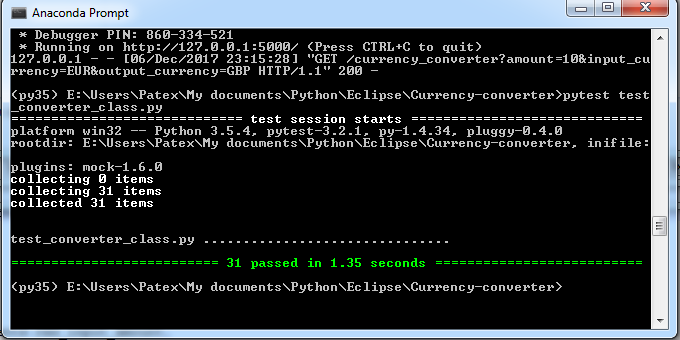

# Currency-converter
> Currency converter based on fixer.io

This repository contains 2 applications:

- Command line interface: `currency_converter.py`
	- convert amounts using command line arguments
- Flask API - `site.py`
	- convert amounts using URIs

Both of these apps are using the `CurrencyConverter` class from `converter_class.py`.

- It uses [fixer.io](http://fixer.io/) in the background to retrieve the actual conversion rates.
- The application has been developed using the TDD methodology


## Testing

To run the tests use py.test

```python
pytest test_converter_class.py
```

Example output:



## Usage example

- There are three parameters in both applications:
	- `amount` - amount which we want to convert - float
	- `input_currency` - input currency - 3 letters name or currency symbol
	- `output_currency` - requested/output currency - 3 letters name or currency symbol. If output currency is omitted, the amount is converted to every possible currency (currencies available from fixer.io).

> Note: There are symbols which represent more than one currency. E.g. $ can be USD, AUD, etc. If you provide this type of symbol as input_currency an error will be raised. If you use this type of symbol as output, the amount is converted to every possible currency represented by that symbol.

**CLI app**

- For listing the parameters, try: `python currency_converter.py -h`

```
Currency converter CLI

optional arguments:
  -h, --help            show this help message and exit
  --amount RAW_INPUT_AMOUNT
                        Input amount to be converted
  --input_currency RAW_INPUT_CURRENCY
                        Input currency. 2 options: 3-letter currency code;
                        currency symbol
  --output_currency RAW_OUTPUT_CURRENCY
                        Output currency. 2 options: 3-letter currency code;
                        currency_symbol. Optional parameter, if omitted, all
                        available currencies will be used
```

Examples:

```
python currency_converter.py --amount 100.0 --input_currency EUR --output_currency CZK
```

```
{   
    "input": {
        "amount": 100.0,
        "currency": "EUR"
    },
    "output": {
        "CZK": 2563.6, 
    }
}
```

```
python currency_converter.py --amount 100.0 --input_currency EUR
```

```
{
    "input": {
        "amount": 100.0,
        "currency": "EUR"
    },
    "output": {
        "AUD": 155.65,
        "BGN": 195.58,
        "BRL": 381.93,
        "CAD": 149.63,
        "CHF": 116.78,
        "CNY": 781.69,
        "CZK": 2563.6,
        "DKK": 744.21,
        "GBP": 88.33,
        "HKD": 923.23,
        "HRK": 754.63,
        "HUF": 31445.0,
        "IDR": 1600700.0,
        "ILS": 415.19,
        "INR": 7624.3,
        "JPY": 13252.0,
        "KRW": 129150.0,
        "MXN": 2220.3,
        "MYR": 481.6,
        "NOK": 975.75,
        "NZD": 171.41,
        "PHP": 5989.1,
        "PLN": 421.42,
        "RON": 463.2,
        "RUB": 6979.1,
        "SEK": 992.65,
        "SGD": 159.25,
        "THB": 3855.9,
        "TRY": 454.89,
        "USD": 118.17,
        "ZAR": 1598.5
    }
}
```

**API**

Run `python site.py`

Open the browser, and you try to run the following uris:

```
http://localhost:5000/currency_converter?amount=10&input_currency=EUR&output_currency=$
```

```
{
  "input": {
    "amount": 10.0, 
    "currency": "EUR"
  }, 
  "output": {
    "AUD": 15.56, 
    "CAD": 14.96, 
    "HKD": 92.32, 
    "MXN": 222.03, 
    "NZD": 17.14, 
    "SGD": 15.93, 
    "USD": 11.82
  }
}
```

```
http://localhost:5000/currency_converter?amount=money&input_currency=EUR&output_currency=$
```

```
{
  "input": {
    "amount": "money", 
    "currency": "EUR"
  }, 
  "output": {
    "error": "Conversion error, check the input parameters"
  }
}
```

> The last example shows an example of an error


## Installation

These were developed using the Anaconda distribution. The enviroment is exported to `currency35.yml`

To create the same environment, use:
```
conda env create -f currency35.yml
```

If you are using a different distribution use `requirements.txt` (use with virtualenv)

More info to be added later


## Development setup

To be added later

## TODO

Code documentation

## Release History


* 0.0.1
    * Work in progress

## Meta

Gabor Patassy – patex1987@gmail.com

[https://github.com/patex1987](https://github.com/patex1987)

## Contributing

To be added later
